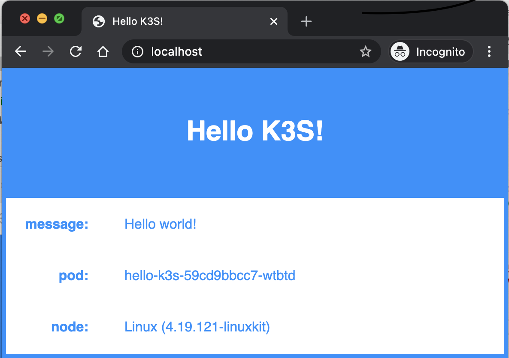
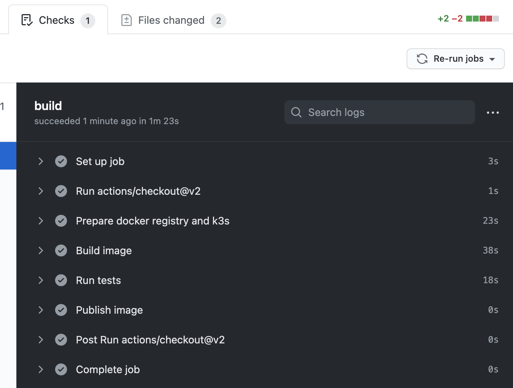
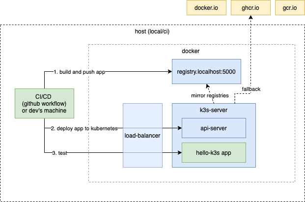

# hello-k3s
Fast integration test with kubernetes and local registry


# Getting started

## Prerequisites

- [kubectl](https://kubernetes.io/docs/tasks/tools/install-kubectl/)
- [k3d](https://github.com/rancher/k3d) - you can install it with the command: `brew install k3d` or `curl -s https://raw.githubusercontent.com/rancher/k3d/main/install.sh | bash`
- [node.js](https://nodejs.org/)
- Docker configured with 4GB RAM

## Run it as it is

---
Clone the repository
```
git clone git@github.com:pbochynski/hello-k3s.git
cd hello-k3s
```

Start docker registry and k3s cluster:
```
./create-cluster-k3d.sh
```
It works on Mac OS. If you work on Linux try `create-cluster-k3s.sh` instead. On Windows get WSL 2 (Windows Subsystem for Linux) and try Linux path (I didn't test it - feedback appreciated).

And deploy `hello-k3s` application:
```
kubectl apply -f hello-k3s.yaml
```

Open your default browser and enter: [http://localhost](http://localhost)


You should see something like this:



# Clean up

Just delete the cluster:
```
./delete-cluster.sh
```

If you want to keep the cluster and just undeploy application:
```
kubectl delete -f hello-k3s.yaml
```


# Run tests

Make sure that your cluster is up and running, go to app folder, install dependencies and execute the tests:

```
cd app
npm install
npx mocha integration-test
```

In the result you should see something like this:

```
  Test on kubernetes
Service hello-k3s created
Deployment hello-k3s created
    ✓ Hello world should be deployed (8233ms)
    ✓ Service should get external IP
    ✓ Service should return message
    ✓ Clean up


  4 passing (9s)
```
The first run takes more time (>10s) and depends on your network speed. 
# Development guide

## Modify deployment and check tests

Let's change the message from **Hello world!** to something else, like **Hello me!**. Modify the deployment in [hello-k3s.yaml](hello-k3s.yaml) and add environment variable `MESSAGE` with value `Hello me!` (uncomment it):
```
    spec:
      containers:
      - name: hello-k3s
        image: ghcr.io/pbochynski/hello-k3s:0.1.1
        imagePullPolicy: Always
        ports:
        - containerPort: 8080
        env:
        - name: MESSAGE
          value: Hello me!
```

You can deploy it manually to see if it works:
```
kubectl apply -f hello-k3s.yaml
```
or you can just execute the tests:
```
npx mocha integration-test
```
If you deployed the application you should see the new message in the application ([http://localhost](http://localhost)). But if you run the test you will se error:
```
  3 passing (3s)
  1 failing

  1) Test on kubernetes
       Service should return message:

      AssertionError: expected 'Hello me!' to equal 'Hello world!'
      + expected - actual

      -Hello me!
      +Hello world!
 
```
You can easily fix it changing the [test](app/integration-test/kubernetes-test.js). I believe you know what to do, but in case you don't here is small hint: replace `world` with `me` ;-).

When you are done you should see tests green again.

## Modify the code and build new docker image

Let's assume the change cannot be done in the deployment and you need to modify the code, build the new application image and test it on kubernetes. It will be simple:
1. Revert the change in the deployment (comment out `MESSAGE` environment variable in the [hello-k3s.yaml](hello-k3s.yaml) file).
2. Run tests. They **should fail** as you reverted only deployment changes and test expects **Hello me!** message.
3. Change the code in [server.js](app/server.js) (replace `world` with `me`)
4. Build the docker image and push it to local docker registry (you need to go up in the folder structure from app to the root folder of the project first):
    ```
    cd ..
    ./docker-build-push.sh
    ```
5. Run tests. This time they **should pass**.

Now you can wonder why they pass? I didn't change the deployment. It should still use the original image: `ghcr.io/pbochynski/hello-k3s:0.1.1` which returns `Hello world!` message. But in your browser you can see `Hello me!`
The answer is in the next [chapter](#registry-mirror).

## Create Pull Request

Create a fork of the repository, push the changes to it and create the Pull Request. I assume you know that basics, but if not you can find all the information in [github help](https://docs.github.com/en/github/collaborating-with-issues-and-pull-requests/working-with-forks).

If you did everything right (code & test changes) you should see a successful check in your PR, like this:


# Registry mirror

## Why do you need registry mirror?
Working with kubernetes means deploying container images. `hello-k3s` image size is 181 MB. Average application is composed from many such images and additionally requires few third party images. You can safely assume that typical cloud application requires more than 1GB of images. If you work with local kubernetes created on-demand you need to download them each time. With high-speed internet connection it is not a big issue, but these days many of us work from home and struggle with limited bandwidth. With 30MB connection the startup of your cluster can be delayed by several minutes - probably you don't want it.

## How does it work?



# Links
The hello-k3s application is modified version of [hello-kubernetes](https://github.com/paulbouwer/hello-kubernetes) from [Paul Bouwer](https://github.com/paulbouwer)